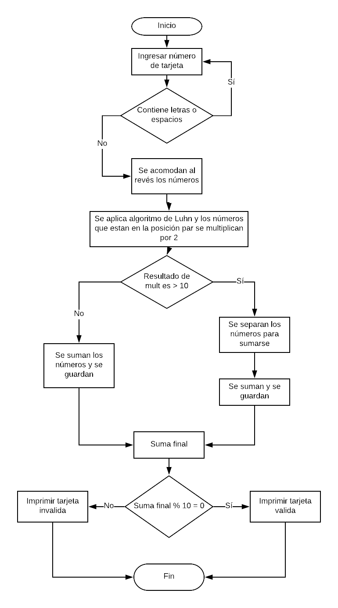

# Tarjeta de Crédito Válida

### Descripción

Crea una web que pida, por medio de un prompt(), el número de una tarjeta de crédito y confirme su validez según el algoritmo de Luhn.

## Pseudocódigo

1. Pedir al usuario que ingrese los números de su tarjeta.

2. Comprobar que no contiene letras o espacios.

3. Acomodar los números al revés.

4. Aplicar el algoritmo de Luhn.

5. Devolver si la tarjeta es válida o no.

## Diagrama de flujo

### Descripción

Se muestra la ruta que seguirá el programa

 
